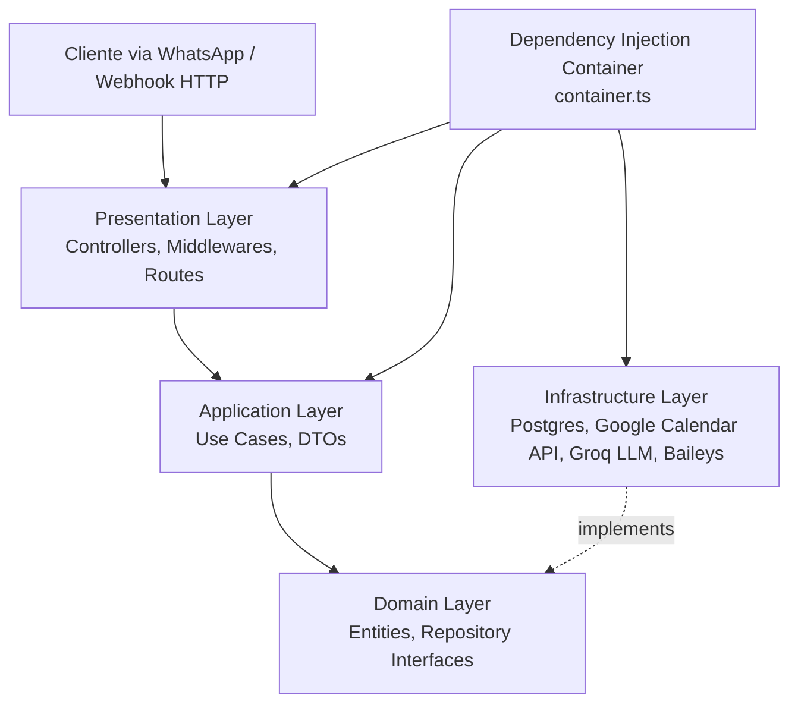
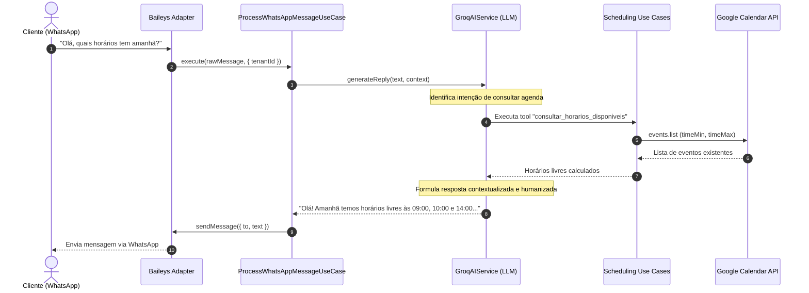
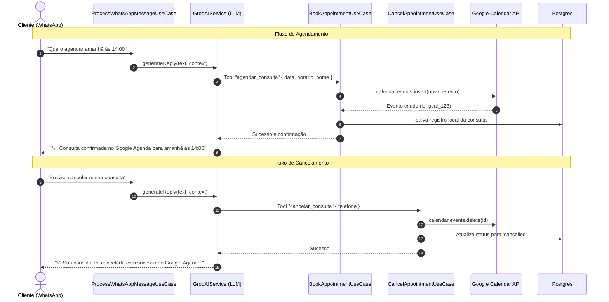

# Documentação de Arquitetura - zendaBot

O **zendaBot** é uma plataforma multi-tenant de agendamento automatizado via WhatsApp com Inteligência Artificial, integrada em tempo real ao **Google Calendar** e persistência em banco de dados relacional (PostgreSQL).

---

## 1. Visão Geral da Arquitetura (Clean Architecture)

A arquitetura segue rigorosamente os princípios da **Clean Architecture** (Arquitetura Limpa), desacoplando o núcleo das regras de negócio de frameworks, bibliotecas externas e banco de dados.



---

## 2. Estrutura de Diretórios do Backend

```
backend/src/
├── domain/                      # Camada de Domínio (independente de frameworks)
│   ├── entities/                # Entidades puras do negócio (User, Tenant, Appointment, Contact)
│   ├── errors/                  # Erros de domínio e de negócio (AppError)
│   └── repositories/            # Contratos/Interfaces (Ports) para dados e serviços externos
│       ├── IAIService.ts
│       ├── IAppointmentRepository.ts
│       ├── IGoogleCalendarService.ts
│       ├── ISecurityService.ts
│       ├── ITenantRepository.ts
│       ├── IUserRepository.ts
│       └── IWhatsAppService.ts
│
├── application/                 # Camada de Aplicação (Casos de Uso e Orquestração)
│   ├── dtos/                    # Contratos de transferência de dados (AuthDto, SchedulingDto)
│   └── use-cases/
│       ├── auth/                # Casos de uso de autenticação (Register, Login)
│       ├── scheduling/          # Casos de uso de agendamento (Book, Cancel, Slots, List)
│       └── whatsapp/            # Caso de uso de processamento de mensagens WhatsApp
│
├── infrastructure/              # Camada de Infraestrutura (Implementações e Adaptadores)
│   ├── database/                # Conexão Pool Postgres, Migrações e Repositórios SQL
│   ├── external/
│   │   ├── google/              # Integração direta com Google Calendar API v3
│   │   ├── groq/                # Integração com Groq LLM (Llama 3.3) com Function Calling / Tools
│   │   └── whatsapp/            # Integração com @whiskeysockets/baileys (multi-tenant sessions)
│   └── security/                # Criptografia de senhas (Bcrypt) e Tokens Stateless (JWT)
│
├── presentation/                # Camada de Apresentação (HTTP / REST)
│   └── http/
│       ├── controllers/         # AuthController, SchedulingController, WhatsAppController
│       ├── middlewares/         # AuthMiddleware, ErrorHandler
│       └── routes/              # Definições modulares das rotas Express
│
├── container.ts                 # Container de Injeção de Dependências
├── app.ts                       # Configuração da aplicação Express (middlewares, rotas, CORS)
└── server.ts                    # Ponto de entrada do servidor (migrações e bootstrap)
```

---

## 3. Modelo Multi-Tenant

Cada empresa/profissional cadastrado representa um **Tenant** no sistema com seu próprio contexto isolado:
- **Tenant ID**: Identificador único do estabelecimento.
- **Configurações de Agenda (`calendarConfig`)**:
  - `calendarId`: ID do Google Agenda da empresa (ex: `clinica@gmail.com` ou ID de grupo).
  - `timeZone`: Fuso horário do estabelecimento (ex: `America/Sao_Paulo`).
  - `businessHoursStart` e `businessHoursEnd`: Horário de atendimento (ex: `08:00` às `18:00`).
  - `appointmentDurationMinutes`: Duração padrão do slot (ex: `30` ou `60` minutos).
  - Autenticação Google: Suporte flexível a Service Account (`serviceAccountEmail`, `serviceAccountPrivateKey`), OAuth2 (`refreshToken`, `clientId`, `clientSecret`) ou API Key.
- **Sessões Isoladas de WhatsApp**:
  - Diretório de autenticação segregado por tenant (`auth/tenant_<tenantId>/`).
  - Socket Baileys dedicado roteado para cada tenant.

---

## 4. Fluxo da IA com Google Agenda (Function / Tool Calling)

A IA consulta e manipula diretamente o Google Agenda utilizando as ferramentas nativas de Chamada de Função (*Function Calling*):



### Agendamento e Cancelamento



---

## 5. Estratégia de Fallback Resiliente

Para garantir alta disponibilidade e continuidade operacional:
- Caso a API da LLM (Groq) fique temporariamente instável ou atinja limites de cota, o serviço ativa automaticamente o **`fallbackIntentHandler`**.
- O fallback utiliza detecção heurística de padrões para datas (ex: `"amanhã"`, `"2026-10-15"`, `"14:00"`) e palavras-chave (`"cancelar"`, `"agendar"`, `"horários"`), acionando os mesmos casos de uso diretamente no Google Calendar.

---

## 6. Suíte de Testes Automatizados

O sistema conta com 100% de aprovação nos testes unitários e de integração:
- **`tests/auth/auth.use-cases.test.ts`**: Testes de registro, login, validação de e-mail e hash de senhas.
- **`tests/scheduling/google-calendar.service.test.ts`**: Testes isolados com mocks do Google Calendar API (cálculo de slots livres com conflitos, criação e exclusão de eventos).
- **`tests/scheduling/scheduling.use-cases.test.ts`**: Testes dos Use Cases de negócio de agendamento.
- **`tests/ai/groq-ai.service.test.ts`**: Testes do ciclo de vida das conversas, chamadas de ferramentas e fallback determinístico.
- **`tests/whatsapp/whatsapp.message-flow.test.ts`**: Testes do roteamento multi-tenant dos sockets Baileys e tratamento de mensagens recebidas.
- **`tests/integration/api.test.ts`**: Testes ponta a ponta da API HTTP Express (Auth, Scheduling e WhatsApp Webhook).
